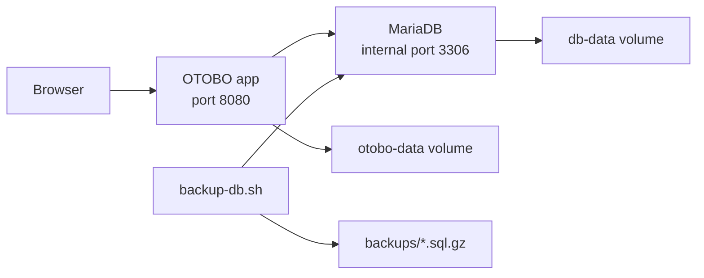

# Architecture

This lab keeps the layout simple: one OTOBO application container and one MariaDB container on the same Docker network.

## Services

| Service | Purpose |
|---|---|
| `otobo` | Runs the OTOBO web application |
| `db` | Stores OTOBO data in MariaDB |

## Volumes

| Volume | Purpose |
|---|---|
| `otobo-data` | Keeps OTOBO application data across restarts |
| `db-data` | Keeps MariaDB data across restarts |

## Network

The containers use the `otobo-lab-net` Docker network. The database is not published to the host. OTOBO connects to it with the internal hostname `db`.
